# STA-380 Exercises

Here is the github link: [STA-380
Exercises](https://github.com/lyq-qi/STA380-Group1)

## Green Buildings

### The goal

An Austin real-estate developer is interested in the possible economic
impact of “going green” in her latest project: a new 15-story mixed-use
building on East Cesar Chavez, just across I-35 from downtown. Will
investing in a green building be worth it, from an economic perspective?
The baseline construction costs are $100 million, with a 5% expected
premium for green certification.

The developer has had someone on her staff, who’s been described to her
as a “total Excel guru from his undergrad statistics course,” run some
numbers on this data set and make a preliminary recommendation. Here’s
how this person described his process.

> I began by cleaning the data a little bit. In particular, I noticed
> that a handful of the buildings in the data set had very low occupancy
> rates (less than 10% of available space occupied). I decided to remove
> these buildings from consideration, on the theory that these buildings
> might have something weird going on with them, and could potentially
> distort the analysis. Once I scrubbed these low-occupancy buildings
> from the data set, I looked at the green buildings and non-green
> buildings separately. The median market rent in the non-green
> buildings was $25 per square foot per year, while the median market
> rent in the green buildings was $27.60 per square foot per year: about
> $2.60 more per square foot. (I used the median rather than the mean,
> because there were still some outliers in the data, and the median is
> a lot more robust to outliers.) Because our building would be 250,000
> square feet, this would translate into an additional $250000 x 2.6 =
> $650000 of extra revenue per year if we build the green building.

> Our expected baseline construction costs are $100 million, with a 5%
> expected premium for green certification. Thus we should expect to
> spend an extra $5 million on the green building. Based on the extra
> revenue we would make, we would recuperate these costs in
> $5000000/650000 = 7.7 years. Even if our occupancy rate were only 90%,
> we would still recuperate the costs in a little over 8 years. Thus
> from year 9 onwards, we would be making an extra $650,000 per year in
> profit. Since the building will be earning rents for 30 years or more,
> it seems like a good financial move to build the green building.

The developer listened to this recommendation, understood the analysis,
and still felt unconvinced. She has therefore asked you to revisit the
report, so that she can get a second opinion.

Do you agree with the conclusions of her on-staff stats guru? If so,
point to evidence supporting his case. If not, explain specifically
where and why the analysis goes wrong, and how it can be improved. Do
you see the possibility of confounding variables for the relationship
between rent and green status? If so, provide evidence for confounding,
and see if you can also make a picture that visually shows how we might
“adjust” for such a confounder.

### Green Buildings Analysis

We found many flaws in the analysis done by the “excel guru”. We
disagree with his figures as he only took the median of rent from both
non-green and green building, then use the differences between the two
to calculate extra revenue. He did not consider other factors that might
be affecting the relationship between rent and green status which make
his calculation inefficient. Furthermore, he only took into account the
initial cost of 100 mil and the 5% premium, without considering other
cost-benefits such as savings on electrcity and gas usage in a green
building. Next we will show some analysis we did to look for confounding
variables.

Here, we are doing some data exploratory analysis on the dataset to
discover trends and correlations.

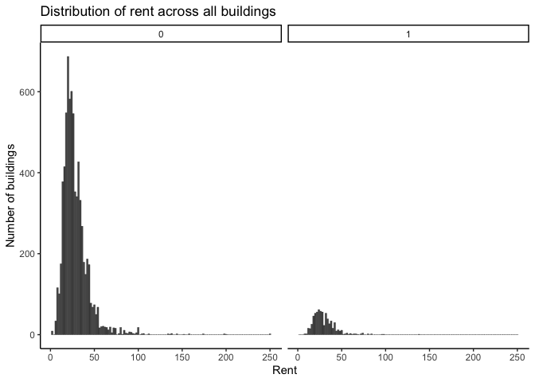

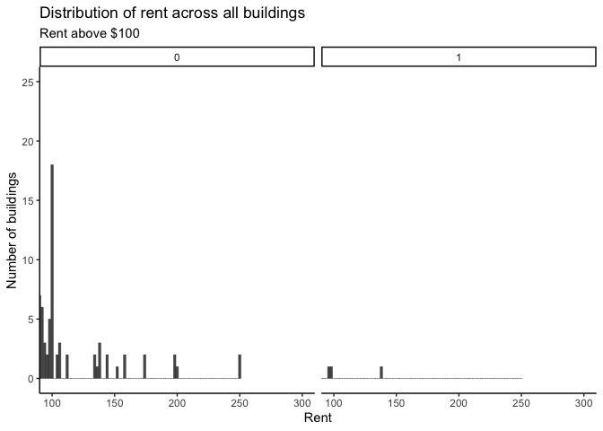

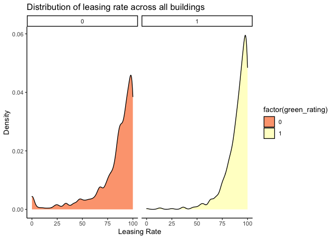

There are many factors that can have an effect on rent, like location,
building quality, appliances and Other amenities, tenant/use mix, etc.
Now we know that the target project is a new 15-story mixed-use building
on East Cesar Chavez, just across I-35 from downtown. Since we have
story information in the dataset, let’s focus on the situation of
15-story buildings.

From the graphic, we can conclude that among 15-story building: 1.the
average rent of green buildings is higher than that of non-green
buildings; 2.the average occupancy rate of green buildings is higher
than that of non-green buildings; 3.all green buildings have a class of
a or b (however, does this bring extra cost)?

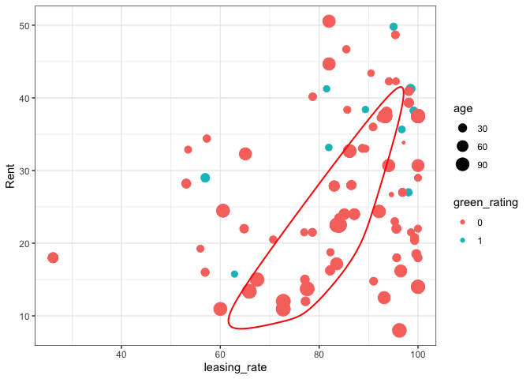

Here, we analyzed some variables that might be affecting the
relationship between green status and rent.

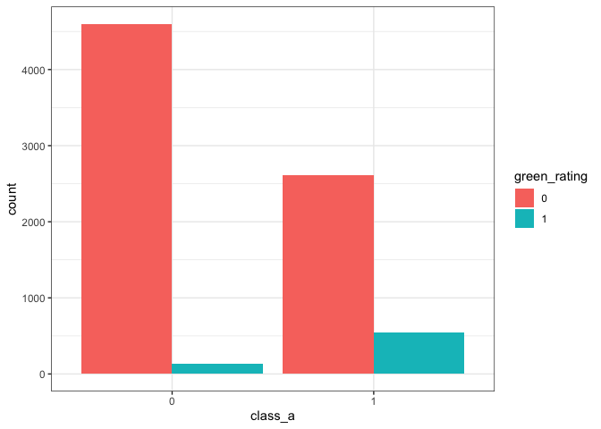

Then we dived in on the relationship between class a and rent
specifically and saw that class a building generally have a higher rent

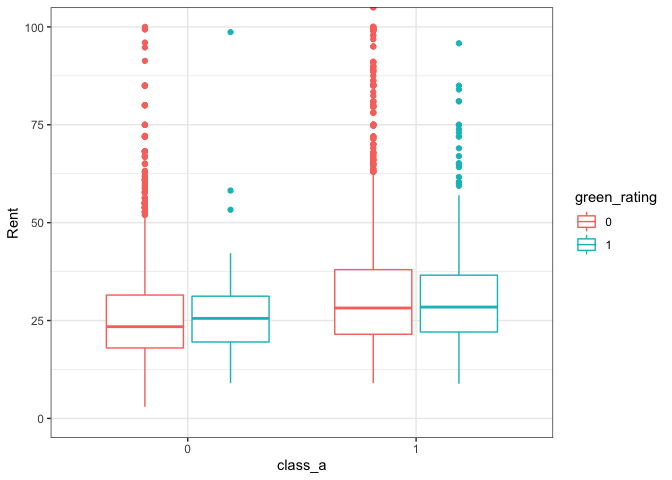

Since most green buildings are of class a, class a can be a confounding
variable that is also a part of the reason why rent increases in respect
to green status. To adjust that, we can hold the class variable constant
across buildings, and compute median rent from those buildings.

#### Profit calculations when class\_a eqauls to 1.

    ## [1] "Report"

    ## [1] "Expected rent price for Green building: 28.44 Expected rent price for Non-Green building:28.2"

    ## [1] "Expected leasing rate for Green building: 0.9363 Expected rent price for Non-Green building:0.9263"

    ## [1] "Expected yearly rent for Green building: 6657093 Expected yearly rent for Non-Green building:6530415"

    ## [1] "Expected electric Rate for the building: 0.032737397 Expected gas Rate for the building: 0.01029615"

    ## [1] "Expected electric/gas usage for the Green building: 0.9 Expected electric/gas usage for the Non-Green Building: 1"

    ## [1] "Expected expenses for the Green building: 9682.55 Expected expenses for the Non-Green building: 10758.39"

    ## [1] "Expected profit for Green Building: 6647410.45 Expected profit for Non-Green Building: 6519656.61"

    ## [1] "Expected profit difference between a green and non-green building: 127753.84"

    ## [1] "Expected payback period: 39.14"

#### Profit calculations when class\_a equals to 0.

    ## [1] "Report"

    ## [1] "Expected rent price for Green building: 25.55 Expected rent price for Non-Green building:23.43"

    ## [1] "Expected leasing rate for Green building: 0.898 Expected rent price for Non-Green building:0.8715"

    ## [1] "Expected yearly rent for Green building: 5735975 Expected yearly rent for Non-Green building:5104811.25"

    ## [1] "Expected electric Rate for the building: 0.032737397 Expected gas Rate for the building: 0.01029615"

    ## [1] "Expected electric/gas usage for the Green building: 0.9 Expected electric/gas usage for the Non-Green Building: 1"

    ## [1] "Expected expenses for the Green building: 9682.55 Expected expenses for the Non-Green building: 10758.39"

    ## [1] "Expected profit for Green Building: 5726292.45 Expected profit for Non-Green Building: 5094052.86"

    ## [1] "Expected profit difference between a green and non-green building: 632239.59"

    ## [1] "Expected payback period: 7.91"

In conclusion, we suggest that the Austin real-estate developer should
only compete in the non-class A market if they decided to make a green
building. That is because a non-class A green building will generate
more profit resulting in a shorter pay back period.

## Flights at ABIA

Your task is to create a figure, or set of related figures, that tell an
interesting story about flights into and out of Austin. Provide a clear
annotation/caption for each figure, but the figure should be more or
less stand-alone, in that you shouldn’t need many, many paragraphs to
convey its meaning. Rather, the figure together with a concise caption
should speak for itself as far as possible.

### Airport Analysis

First, we want to create a histogram with the arriving and departing
flights at Austin-Bergstrom. This includes looking at flights that were
not delayed.

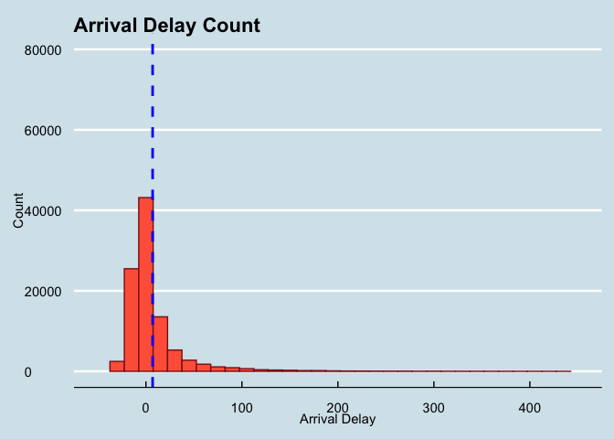

    ## [1] "The average arrival delay is 6.95 minutes."

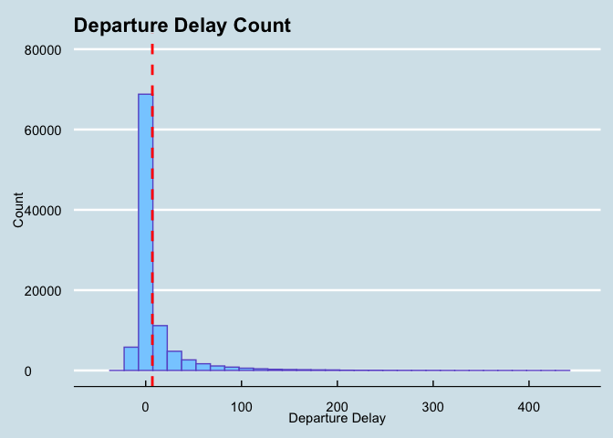

    ## [1] "The average departure delay is 9.04 minutes."

As we can see from the arrival histogram, most flights coming into
Austin-Bergstrom are on time/early or delayed by less than 10 minutes.
The flight departure histogram shows there are more delays in departures
than arrivals. The departing flights have a delay that is around 2
minutes longer than that of an arriving flight.

### Carrier Analysis

Next, we want to analyze the performance of the carriers at
Austin-Bergstrom Airport.

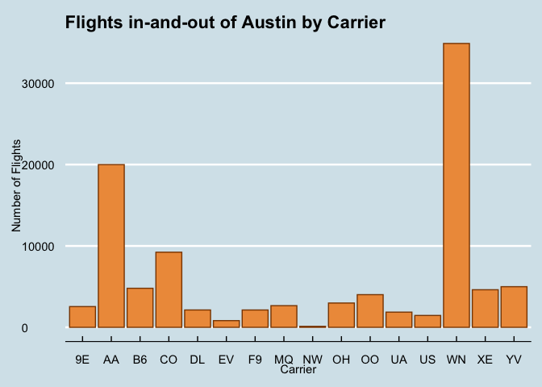

    ## [1] "Southwest had the highest flight count at AIBA with 34876."

    ## [1] "Followed by American Airlines who had an AIBA flight count of 19995."

    ## [1] "The company with the least amount of flights at AIBA is Northwest Airlines with 121 flights."

If I am an Austin resident looking to open an airline credit card, I
would look closely at what Southwest offers since they have the most
flights at AIBA.

Let’s take a look at the portion of flights delayed by each carrier.

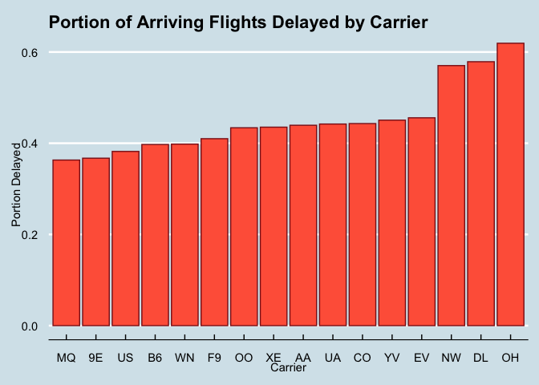

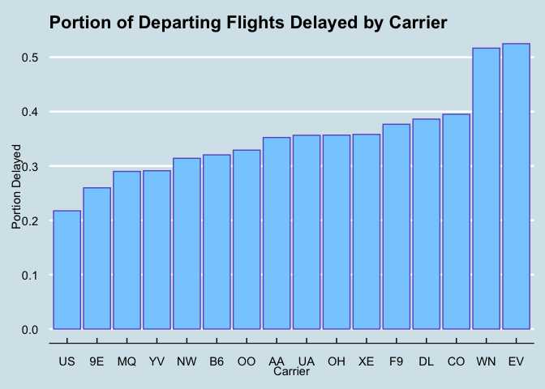

Not all delays are created equal. We must know the average time(minutes)
that a carrier will delay a flight before we can make a judgement about
which airline we want to avoid on future trips.

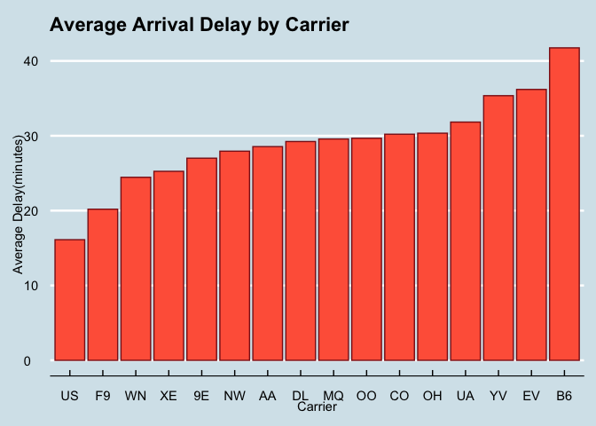

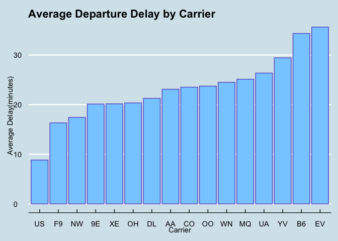

ExpressJet Airlines and Southwest Airlines have the highest portion of
departing flights delayed, but ExpressJets’ delays are around 10 minutes
longer than Southwest delays. JetBlue is also intriguing because they
are middle of the pack in terms of portion delayed, but their delays are
avering over 30 minutes. US Airways has the shortest delays of any of
the carriers(arrival and departure), but they have a pretty low flight
count at Austin-Bergstrom, so chances are that we won’t get many
destination and time options to work with an airline like US Airways.

A 10 minute delay can be a little annoying, but a 25 minute delay can
ruin your plans. We want to look into which carrier is most likely to
have a 25 minute delay.

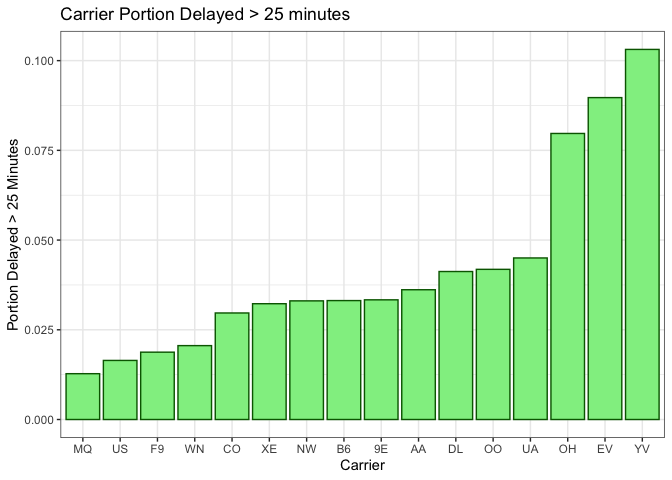

The portion of flights delayed more than 25 minutes is extremely low,
but the airline with the highest portion delayed more than 25 minutes is
Mesa Airlines. We don’t believe that the portion of delays greater than
25 minutes is an important factor when planning a trip so we don’t need
to worry about a long delay messing up our itinerary.

### Carrier Conclusion

Southwest and American Airlines have the most flights in-and-out of
Austin-Bergstrom, therefore they will have the most time/route options
of any carrier. Southwest is on the high-end of departure delays, but on
the low-end in terms of arrival delays. If we had to choose between
Southwest and American Airlines based on the data, we would choose
American Airlines since they have a lower portion of departures getting
delayed and their departure delays are shorter than Southwest. Leaving
on time is more important to us than arriving on time. JetBlue and
ExpressJet are airlines that we would avoid, but it won’t be hard since
they do not have many flight options at ABIA.

### Calendar Analysis

First, lets examine at the number of flights per month at
Austin-Bergstrom.

It is not surprising to see that the Spring and Summer have the highest
flight count. We can not test this, but we believe Longhorn football is
the reason for less flights in the Fall.

Texas weather can be hard to predict and changes so quickly, but we
wanted to know which months have the most weather delays in Austin,
Texas.

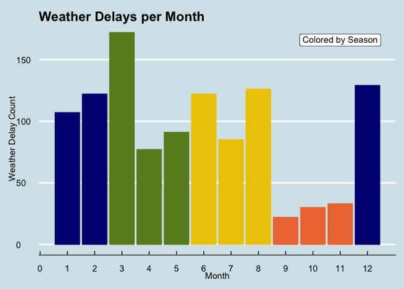
March has the most amount of weather delays, followed by December and
August. When looking at seasonality the Winter months have the most of
weather delays, while Autum has the least amount.

Lastly, we want to investigate which months have the most delays and
which months have the highest portion of delayed flights.

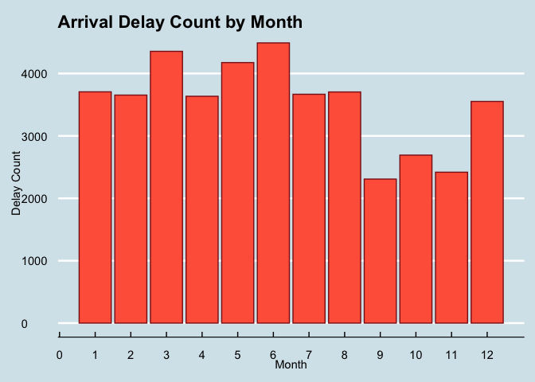

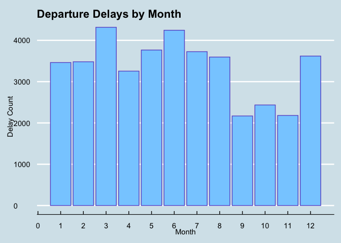

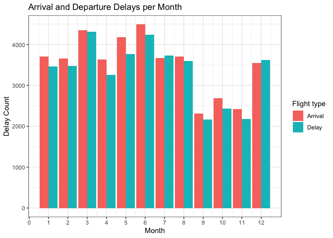

March and June have the most delays, and that is not shocking since
Spring Break and early Summer are huge travel times at Austin-Bergstrom.
We are surprised at the amount of delays in December since that is a
month with the second lowest flight count in-and-out of Austin, Texas.

Do a higher portion of flights get delayed in December? We want to test
that question next.

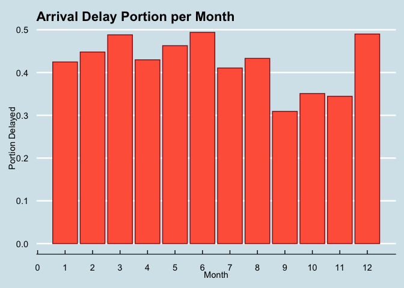

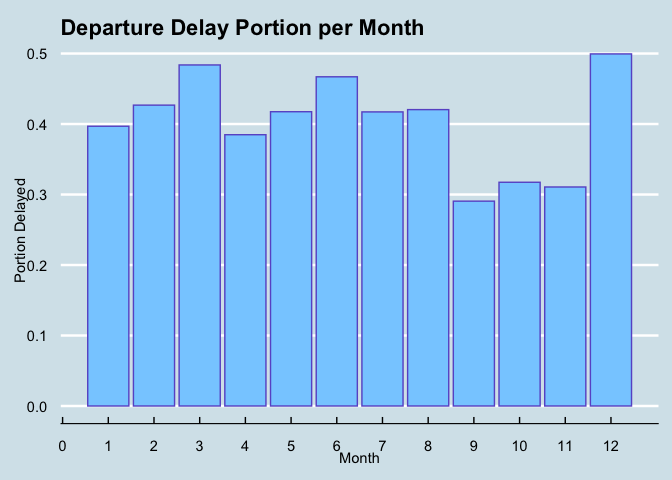

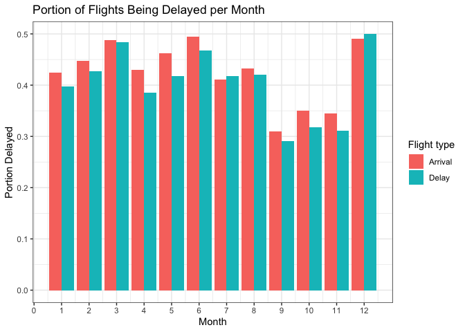

If you decide to fly out of Austin-Bergstrom in December, you have
around a 50% chance of having your flight delayed. This graph adds
validity to notion that airports around the holidays get crazy. They
even made a movie about it called “Planes, Trains, and Automobiles”.

### Calendar Conclusion

The Spring and Summer are the busiest seasons at ABIA. March(spring
break) and June(school is finished) have the highest amount of delays,
while December has the highest portion of delays. March is the month
with the most amount of weather delays, but the Winter is the season
with the most weather delays. In the future, we would like to revisit
this dataset with more years so we can identify is March is typically a
bad weather month in Austin or was March 2008 a bad weather month in
Austin. The information we learned in the calendar section confirmed
priors we had from our traveling experience, but it is nice to get
confirmation.

### Destination Analysis

We are interested to know where Austin residents are flying and how many
of the popular destinations have a high portion of delayed flights.

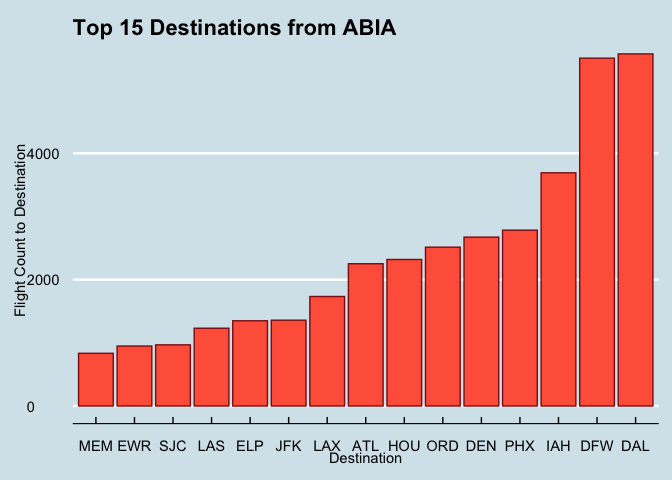

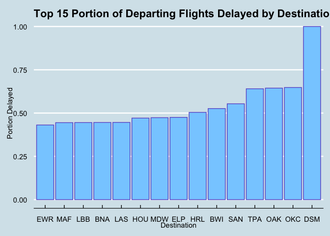

We have a large amount of flights that are in the state of Texas with 4
of the top 7 airport destinations being in Texas. When we look at the
portion of flights delayed by destination, Houston(Hobby) and Newark are
the only airports in the top 15 flight count and top 15 portion delayed.
There is only 1 flight to Des Moines, Iowa and it was delayed, so that
explains why it has a high portion of flights delayed.

Nobody likes getting home later than expected, let’s look at the arrival
delays by flight origin location.

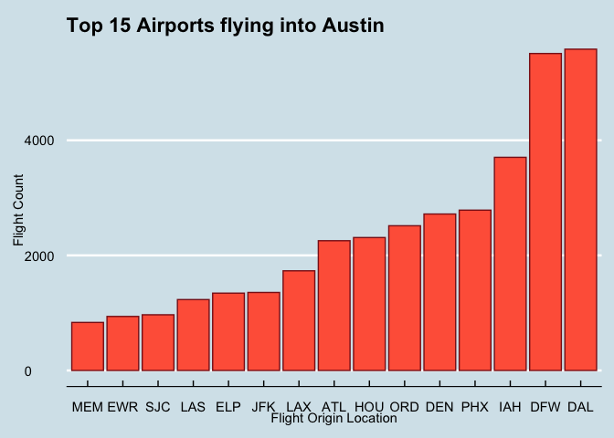

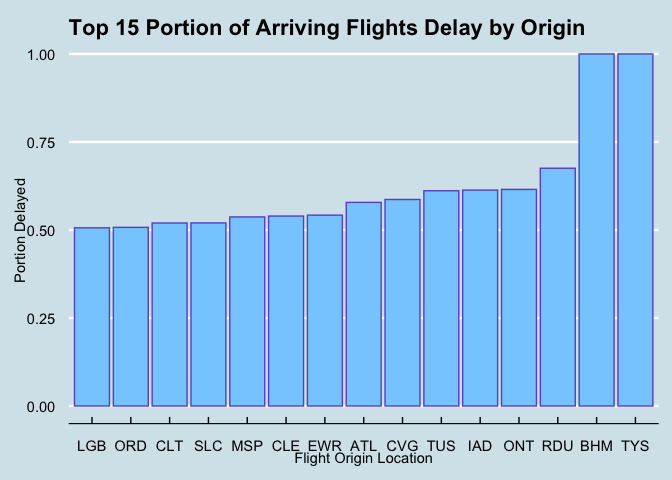

The arrival flight count looks pretty similar to the departure flight
count. Newark is the only airport on both lists again! They need to get
it together.

### Destination Analysis

A large chunk of flights leaving Austin-Bergstrom end up staying in the
state of Texas. Most of the popular flight routes are pretty efficient
and do not have a large portion of flights being delayed(arrival and
departure). You just might want to think twice before you book a flight
to Newark, New Jersey.

## Portfolio Modeling

In this problem, you will construct three different portfolios of
exchange-traded funds, or ETFs, and use bootstrap resampling to analyze
the short-term tail risk of your portfolios. You should assume that your
portfolios are rebalanced each day at zero transaction cost. For
example, if you’re allocating your wealth evenly among 5 ETFs, you
always redistribute your wealth at the end of each day so that the equal
five-way split is retained, regardless of that day’s
appreciation/depreciation

-   Construct three different possibilities for an ETF-based portfolio,
    each involving an allocation of your $100,000 in capital to
    somewhere between 3 and 10 different ETFs.
-   Download the last five years of daily data on your chosen ETFs
-   Use bootstrap resampling to estimate the 4-week (20 trading day)
    value at risk of each of your three portfolios at the 5% level.  
-   Write a report summarizing your portfolios and your VaR findings.

### Portfolio (1) —— Aggressive Portfolio

Currency ETFs (20%) + Corporate Bonds ETFs (30%) + Equities ETFs (50%)

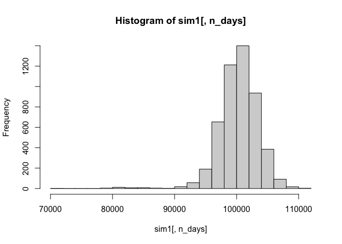

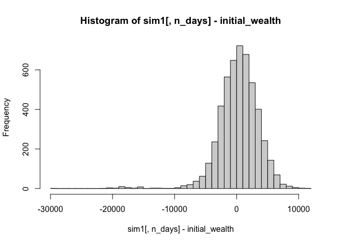

    ## [1] "5% value at risk is: -4377.32300281821"

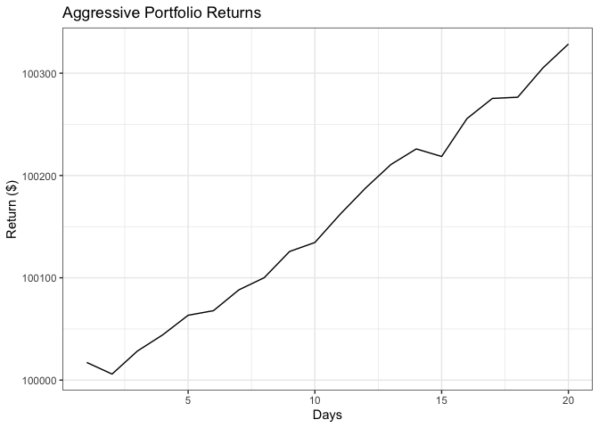

## Portfolio (2) —— Moderate Portfolio

Currency ETFs (30%) + Corporate Bonds ETFs (50%) + Equities ETFs (20%)

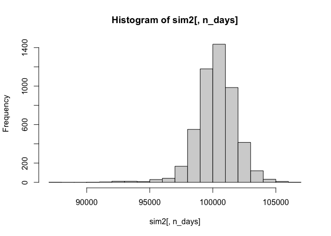

    ## [1] "5% value at risk is: -2093.34202874161"

## Portfolio (3) —— Conservative Portfolio

Currency ETFs (50%) + Corporate Bonds ETFs (30%) + Equities ETFs (20%)

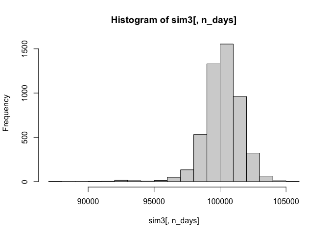

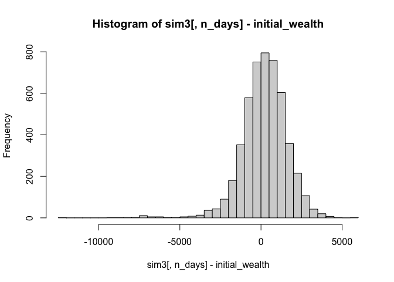

    ## [1] "5% value at risk is: -1895.6922740784"

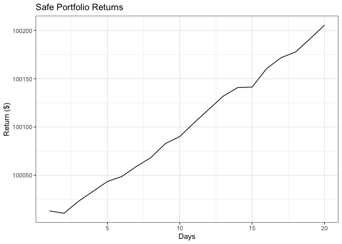

### Portfolio Analysis

Across the three portfolios, we can see that the return on average
increases over the 20 days period. However, the aggressive model return
vs days line graph fluctuate a little bit more then the other two
portfolios. This can be seen on the VaR as well, while the aggressive
portfolio has the highest average return, it also has the highest VaR at
5%. Comparing the returns and VaR of all three models, the moderate
portfolio is the best option for us because it has a relatively high
return that not too far from that of the aggressive model(100296.8 vs
100325.4) and a 5% VaR that is far lower then the of the aggressive
model(2060.641 vs 4354.693). The conservative model on the other hand
have the lowest VaR (1870.43) but the return (100203.6) is also the
lowest therefore we don’t think it is the best option comparing to the
moderate model.

## Market Segmentation

This was data collected in the course of a market-research study using
followers of the Twitter account of a large consumer brand that shall
remain nameless—let’s call it “NutrientH20” just to have a label. The
goal here was for NutrientH20 to understand its social-media audience a
little bit better, so that it could hone its messaging a little more
sharply.Your task to is analyze this data as you see fit, and to prepare
a concise report for NutrientH20 that identifies any interesting market
segments that appear to stand out in their social-media audience. You
have complete freedom in deciding how to pre-process the data and how to
define “market segment.” (Is it a group of correlated interests? A
cluster? A latent factor? Etc.) Just use the data to come up with some
interesting, well-supported insights about the audience, and be clear
about what you did.

First, let’s take a look at data correlation. Practically, if our data
is not highly correlated, we might not need a PCA. As the graph shows,
some of our variables are quite correlated.Thus, we can proceed to PCA
and create a smaller subset of variables.

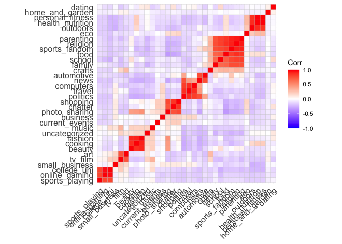

### Principal Component Analysis

    ## Importance of components:
    ##                          PC1    PC2    PC3    PC4   PC5    PC6    PC7   PC8
    ## Standard deviation     2.113 1.7020 1.6012 1.5416 1.486 1.3750 1.2845 1.195
    ## Proportion of Variance 0.131 0.0852 0.0754 0.0699 0.065 0.0556 0.0485 0.042
    ## Cumulative Proportion  0.131 0.2166 0.2920 0.3619 0.427 0.4824 0.5310 0.573
    ##                           PC9  PC10   PC11   PC12   PC13   PC14   PC15   PC16
    ## Standard deviation     1.0716 1.009 0.9670 0.9593 0.9433 0.9314 0.9193 0.8984
    ## Proportion of Variance 0.0338 0.030 0.0275 0.0271 0.0262 0.0255 0.0249 0.0237
    ## Cumulative Proportion  0.6067 0.637 0.6642 0.6913 0.7174 0.7429 0.7678 0.7915
    ##                          PC17   PC18   PC19   PC20   PC21   PC22   PC23   PC24
    ## Standard deviation     0.8479 0.8076 0.7481 0.6950 0.6851 0.6524 0.6490 0.6361
    ## Proportion of Variance 0.0211 0.0192 0.0165 0.0142 0.0138 0.0125 0.0124 0.0119
    ## Cumulative Proportion  0.8127 0.8319 0.8483 0.8625 0.8763 0.8889 0.9012 0.9132
    ##                          PC25   PC26   PC27   PC28  PC29    PC30    PC31
    ## Standard deviation     0.6314 0.6145 0.5979 0.5905 0.584 0.55084 0.48213
    ## Proportion of Variance 0.0117 0.0111 0.0105 0.0103 0.010 0.00892 0.00684
    ## Cumulative Proportion  0.9249 0.9360 0.9465 0.9567 0.967 0.97570 0.98254
    ##                           PC32    PC33    PC34
    ## Standard deviation     0.47489 0.43661 0.42132
    ## Proportion of Variance 0.00663 0.00561 0.00522
    ## Cumulative Proportion  0.98917 0.99478 1.00000

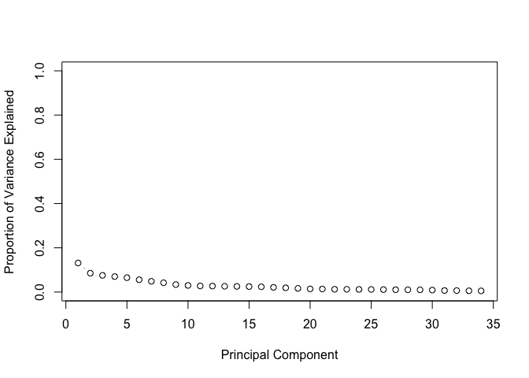

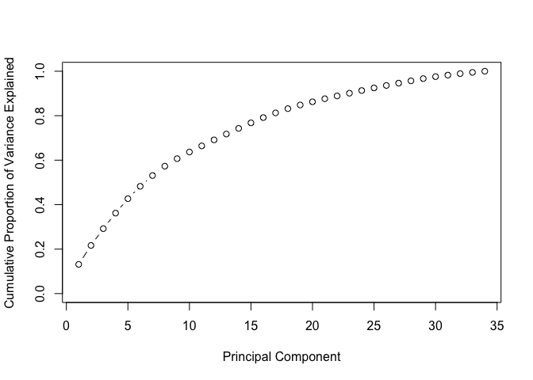

    ## $loadings
    ## 
    ## Loadings:
    ##                  PC1    PC2    PC3    PC4    PC5    PC6   
    ## chatter                                             -0.555
    ## current_events                                      -0.197
    ## travel                          0.486                     
    ## photo_sharing           -0.180                      -0.456
    ## uncategorized           -0.125               -0.119       
    ## tv_film                                      -0.274       
    ## sports_fandom     0.434                                   
    ## politics                        0.559                     
    ## food              0.380                0.145              
    ## family            0.325                                   
    ## home_and_garden                                           
    ## music                   -0.131               -0.153       
    ## news                            0.411                     
    ## online_gaming                                -0.527       
    ## shopping                                            -0.535
    ## health_nutrition                       0.579              
    ## college_uni                                  -0.568       
    ## sports_playing                               -0.444       
    ## cooking                 -0.553                            
    ## eco                                    0.199        -0.185
    ## computers                       0.442                     
    ## business                        0.115               -0.187
    ## outdoors                               0.495              
    ## crafts            0.152                             -0.107
    ## automotive                      0.205               -0.103
    ## art                                          -0.212       
    ## religion          0.446                                   
    ## beauty                  -0.538                            
    ## parenting         0.430                                   
    ## dating                                                    
    ## school            0.361                                   
    ## personal_fitness                       0.563              
    ## fashion                 -0.551                            
    ## small_business                               -0.132 -0.135
    ## 
    ##                  PC1   PC2   PC3   PC4   PC5   PC6
    ## SS loadings    1.000 1.000 1.000 1.000 1.000 1.000
    ## Proportion Var 0.029 0.029 0.029 0.029 0.029 0.029
    ## Cumulative Var 0.029 0.059 0.088 0.118 0.147 0.176
    ## 
    ## $rotmat
    ##          [,1]    [,2]      [,3]    [,4]     [,5]    [,6]
    ## [1,]  0.71630 -0.3661  0.293277  0.2622 -0.27490 -0.3501
    ## [2,]  0.65715  0.5184 -0.006587 -0.2251  0.25277  0.4299
    ## [3,] -0.19764  0.2958  0.855499 -0.3238 -0.14407 -0.1264
    ## [4,] -0.11015  0.1578  0.322297  0.8153  0.40637  0.1711
    ## [5,]  0.05910 -0.2564  0.068959 -0.2909  0.81865 -0.4138
    ## [6,] -0.01935 -0.6474  0.270992 -0.1626  0.06684  0.6900

From the above PC summary, we can see that some PC have attributes that
could fit in to the description of a specific segment such as PC1 which
corresponds to an mid-aged population who have kids and are more
traditional, and PC4 which corresponds to a population that is more
health focused. With these information, we can compare and contrast with
our clustering models later.

    ## Welcome! Want to learn more? See two factoextra-related books at https://goo.gl/ve3WBa

    ## 
    ## Call:
    ## PCA(X = tweets_scale, scale.unit = FALSE, ncp = 10, graph = F) 
    ## 
    ## 
    ## Eigenvalues
    ##                        Dim.1   Dim.2   Dim.3   Dim.4   Dim.5   Dim.6   Dim.7
    ## Variance               4.466   2.896   2.564   2.376   2.208   1.890   1.650
    ## % of var.             13.137   8.520   7.541   6.990   6.496   5.560   4.853
    ## Cumulative % of var.  13.137  21.657  29.198  36.188  42.684  48.244  53.097
    ##                        Dim.8   Dim.9  Dim.10  Dim.11  Dim.12  Dim.13  Dim.14
    ## Variance               1.428   1.148   1.018   0.935   0.920   0.890   0.867
    ## % of var.              4.200   3.377   2.995   2.750   2.706   2.617   2.552
    ## Cumulative % of var.  57.297  60.674  63.669  66.419  69.126  71.743  74.295
    ##                       Dim.15  Dim.16  Dim.17  Dim.18  Dim.19  Dim.20  Dim.21
    ## Variance               0.845   0.807   0.719   0.652   0.560   0.483   0.469
    ## % of var.              2.486   2.374   2.114   1.918   1.646   1.421   1.380
    ## Cumulative % of var.  76.781  79.155  81.269  83.187  84.834  86.254  87.634
    ##                       Dim.22  Dim.23  Dim.24  Dim.25  Dim.26  Dim.27  Dim.28
    ## Variance               0.426   0.421   0.405   0.399   0.378   0.357   0.349
    ## % of var.              1.252   1.239   1.190   1.173   1.111   1.051   1.026
    ## Cumulative % of var.  88.886  90.125  91.315  92.488  93.598  94.649  95.675
    ##                       Dim.29  Dim.30  Dim.31  Dim.32  Dim.33  Dim.34
    ## Variance               0.341   0.303   0.232   0.225   0.191   0.177
    ## % of var.              1.003   0.892   0.684   0.663   0.561   0.522
    ## Cumulative % of var.  96.678  97.570  98.254  98.917  99.478 100.000
    ## 
    ## Individuals (the 10 first)
    ##                      Dist    Dim.1    ctr   cos2    Dim.2    ctr   cos2  
    ## 1                |  6.659 |  1.197  0.004  0.032 |  0.811  0.003  0.015 |
    ## 2                |  4.762 |  0.406  0.001  0.007 | -1.994  0.019  0.175 |
    ## 3                |  6.177 |  0.193  0.000  0.001 |  1.207  0.007  0.038 |
    ## 4                |  5.300 | -1.393  0.006  0.069 | -0.314  0.000  0.004 |
    ## 5                |  3.515 | -1.603  0.008  0.208 |  0.762  0.003  0.047 |
    ## 6                |  4.343 | -0.701  0.002  0.026 |  0.623  0.002  0.021 |
    ## 7                |  6.033 | -0.713  0.002  0.014 | -0.046  0.000  0.000 |
    ## 8                |  5.549 |  0.526  0.001  0.009 |  2.865  0.039  0.267 |
    ## 9                |  8.205 |  2.127  0.014  0.067 |  2.905  0.040  0.125 |
    ## 10               |  9.407 |  5.779  0.102  0.377 | -4.345  0.089  0.213 |
    ##                   Dim.3    ctr   cos2  
    ## 1                -2.413  0.031  0.131 |
    ## 2                -0.190  0.000  0.002 |
    ## 3                 0.907  0.004  0.022 |
    ## 4                 0.273  0.000  0.003 |
    ## 5                 0.303  0.000  0.007 |
    ## 6                 0.624  0.002  0.021 |
    ## 7                 3.350  0.060  0.308 |
    ## 8                -0.947  0.005  0.029 |
    ## 9                -3.510  0.066  0.183 |
    ## 10               -0.616  0.002  0.004 |
    ## 
    ## Variables (the 10 first)
    ##                     Dim.1    ctr   cos2    Dim.2    ctr   cos2    Dim.3    ctr
    ## chatter          |  0.261  1.529  0.068 |  0.333  3.828  0.111 |  0.115  0.515
    ## current_events   |  0.205  0.941  0.042 |  0.115  0.458  0.013 |  0.077  0.233
    ## travel           |  0.252  1.421  0.063 |  0.082  0.233  0.007 |  0.683 18.213
    ## photo_sharing    |  0.381  3.252  0.145 |  0.514  9.121  0.264 | -0.027  0.029
    ## uncategorized    |  0.200  0.894  0.040 |  0.250  2.165  0.063 | -0.057  0.126
    ## tv_film          |  0.208  0.973  0.043 |  0.142  0.694  0.020 |  0.130  0.662
    ## sports_fandom    |  0.611  8.367  0.374 | -0.541 10.098  0.293 | -0.080  0.247
    ## politics         |  0.272  1.656  0.074 |  0.030  0.031  0.001 |  0.792 24.445
    ## food             |  0.632  8.957  0.400 | -0.406  5.703  0.165 | -0.168  1.095
    ## family           |  0.516  5.971  0.267 | -0.337  3.930  0.114 | -0.077  0.234
    ##                    cos2  
    ## chatter           0.013 |
    ## current_events    0.006 |
    ## travel            0.467 |
    ## photo_sharing     0.001 |
    ## uncategorized     0.003 |
    ## tv_film           0.017 |
    ## sports_fandom     0.006 |
    ## politics          0.627 |
    ## food              0.028 |
    ## family            0.006 |

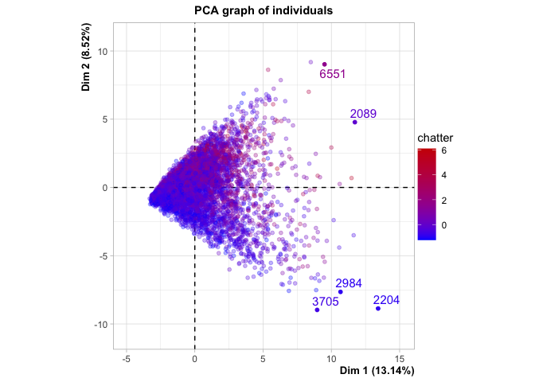

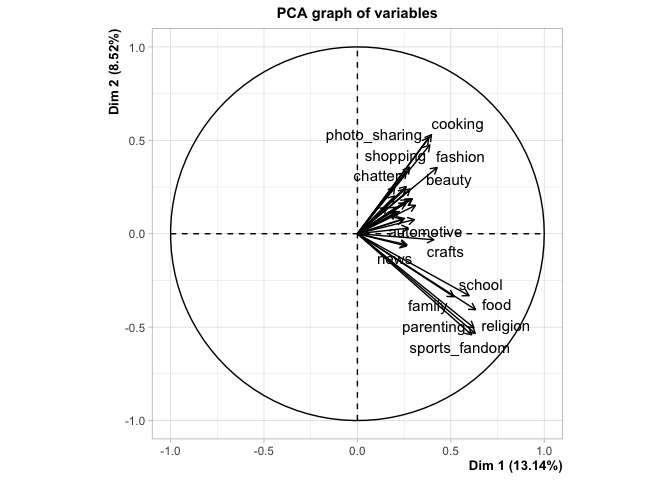

Identifying number of clusters we should generate.

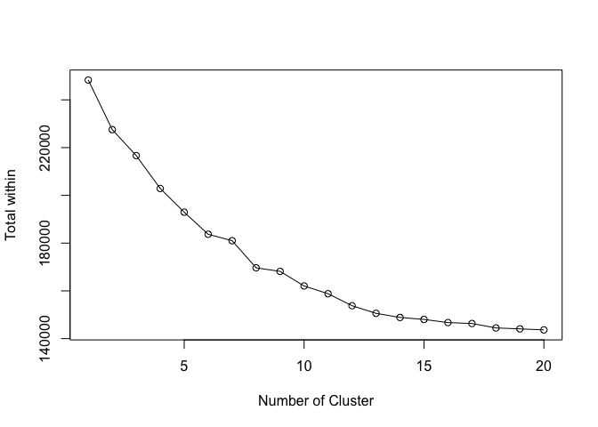

From above figure, we can choose 6 or 10 clusters.

First, we will do a 6 cluster analysis.

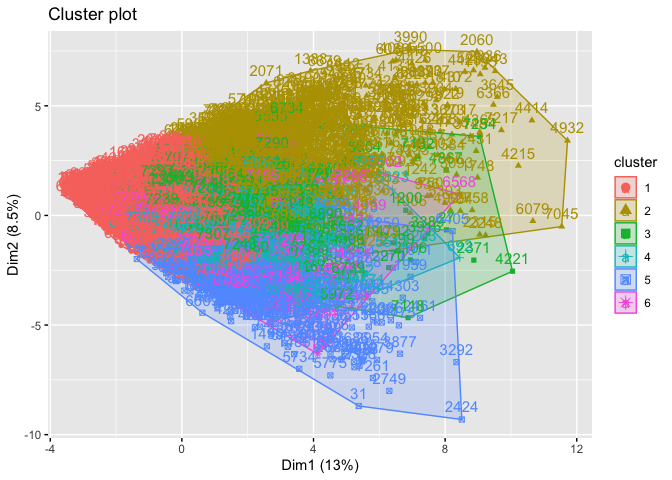

    ## [1] "Cluster Breakdown"

    ## 
    ##    1    2    3    4    5    6 
    ## 0.57 0.10 0.09 0.11 0.07 0.05

    ## # A tibble: 6 x 2
    ##   cluster1 count
    ##      <int> <int>
    ## 1        1  4171
    ## 2        2   724
    ## 3        3   655
    ## 4        4   827
    ## 5        5   534
    ## 6        6   393

The biggest cluster is cluster \#1, which account for around 57% out of
6 six clusters.

### Clusters Profiling

#### Non-scaled clusters

The characteristic summary of NutrientH20’s Twitter followers in the
same cluster are as follows (not scaled):

Cluster 1: Highest photo\_sharing Cluster 2: Highest photo\_sharing,
sports\_fandom, food, religion, parenting Cluster 3: Highest travel,
politics, news, photo\_sharing, computers Cluster 4: Highest
health\_nutrition(10 points higher than 5), personal\_fitness, cooking,
outdoors, photo\_sharing Cluster 5: Highest photo\_sharing(highest among
clusters), cooking (7 points higher than cluster 4),beauty,
fashion,health\_nutrition Cluster 6: Highest college\_uni,
online\_gaming, photo\_sharing,sports\_playing

    ## [1] "The mean for all the values in the cluster is 1.62458623379831"

    ##                       1      2      3       4       5       6
    ## chatter          4.3361 4.3052 4.5573  4.3615  4.8258  4.4020
    ## current_events   1.4407 1.6644 1.6504  1.5381  1.7697  1.4962
    ## travel           1.0741 1.2831 5.6076  1.2213  1.4700  1.5522
    ## photo_sharing    2.3143 2.6630 2.5313  2.7013  6.0393  2.8041
    ## uncategorized    0.7183 0.7652 0.7603  0.9420  1.2547  0.9186
    ## tv_film          1.0110 1.0967 1.2092  0.9915  1.1049  1.7379
    ## sports_fandom    0.9588 5.8191 2.0290  1.1536  1.1086  1.3104
    ## politics         1.0209 1.1119 8.9695  1.2539  1.3839  1.2799
    ## food             0.7475 4.4903 1.4595  2.1040  1.0206  1.2265
    ## family           0.5627 2.4406 0.9252  0.7497  0.8727  1.0534
    ## home_and_garden  0.4313 0.6506 0.6137  0.6191  0.6105  0.6183
    ## music            0.5730 0.7307 0.6473  0.7279  1.2959  0.9440
    ## news             0.6857 1.0138 5.3328  1.1137  1.0225  0.8015
    ## online_gaming    0.5766 1.0000 0.8260  0.8368  1.1049  9.7226
    ## shopping         1.2949 1.4959 1.3725  1.5042  2.0468  1.3333
    ## health_nutrition 1.1005 1.8605 1.6534 12.0169  2.2266  1.7455
    ## college_uni      0.9187 1.2251 1.3237  0.9407  1.5843 10.7277
    ## sports_playing   0.4263 0.7417 0.6427  0.5852  0.8202  2.6565
    ## cooking          0.8619 1.6229 1.2595  3.3071 10.7322  1.4758
    ## eco              0.3707 0.6436 0.5863  0.9214  0.5581  0.4962
    ## computers        0.3618 0.7058 2.4656  0.5659  0.7041  0.5598
    ## business         0.3390 0.4903 0.6748  0.4776  0.6142  0.4224
    ## outdoors         0.3862 0.6865 0.9053  2.7074  0.7753  0.6336
    ## crafts           0.3553 1.0608 0.6260  0.6034  0.6273  0.5903
    ## automotive       0.5649 1.0290 2.3603  0.6312  0.8558  0.8575
    ## art              0.6035 0.8605 0.7130  0.7545  0.9382  1.2239
    ## religion         0.5195 5.1464 1.0366  0.7328  0.8296  0.8244
    ## beauty           0.3452 1.0898 0.4656  0.4281  3.8652  0.4300
    ## parenting        0.4402 4.0000 0.9420  0.7424  0.7397  0.6641
    ## dating           0.5404 0.8481 1.0687  1.0242  0.9139  0.7430
    ## school           0.4625 2.6464 0.7313  0.5683  0.9850  0.4936
    ## personal_fitness 0.6521 1.1809 1.0107  6.4619  1.3315  0.9822
    ## fashion          0.5145 1.0428 0.6672  0.7799  5.5356  0.8855
    ## small_business   0.2647 0.3895 0.4824  0.2902  0.4925  0.4504

The above cluster is not scaled so we can find a lot of repetition of
attributes between clusters, specifically photo\_sharing which is
present in all clusters most likely because photo\_sharing is one of the
most common attributes for tweets. Although still descriptive, some
details might be left out. Next we will take a look at scaled clusters.

#### Scaled clusters

The characteristic summary of NutrientH20’s Twitter followers in the
same cluster are as follows (scaled):

Cluster 1: Highest food, personal\_fitness, out\_doors, cooking,
health\_nutrition Cluster 2: Highest sports\_fandom, food, school,
religion, parenting Cluster 3: Highest travel, politics, news,
automotive, computers Cluster 4: Highest health\_nutrition(higher than
1), personal\_fitness(higher than 1), outdoors(higher than 1), eco,
food(higher than 1 lower than 2) Cluster 5: Highest photo\_sharing,
cooking (higher than cluster 1), beauty, fashion, music Cluster 6:
Highest college\_uni, online\_gaming, art,sports\_playing,tv\_film

    ## [1] "The mean for all the values in the cluster is 0.28608804493521"

    ##                         1         2          3         4         5         6
    ## chatter          -0.01666 -0.025385  0.0457914 -0.009484  0.121653  0.001952
    ## current_events   -0.06230  0.114003  0.1029825  0.014481  0.196992 -0.018546
    ## travel           -0.21664 -0.125803  1.7530823 -0.152683 -0.044604 -0.008923
    ## photo_sharing    -0.14508 -0.017510 -0.0656900 -0.003481  1.217785  0.034109
    ## uncategorized    -0.08980 -0.039501 -0.0447432  0.150069  0.485446  0.124992
    ## tv_film          -0.04186  0.009346  0.0765829 -0.053512  0.014238  0.392669
    ## sports_fandom    -0.29209  1.962482  0.2043666 -0.201729 -0.222582 -0.128963
    ## politics         -0.25875 -0.228892  2.3489996 -0.182288 -0.139650 -0.173769
    ## food             -0.36053  1.767278  0.0442489  0.410623 -0.205294 -0.088258
    ## family           -0.25859  1.422324  0.0658814 -0.091202  0.018861  0.180672
    ## home_and_garden  -0.11297  0.187178  0.1367814  0.144126  0.132327  0.143052
    ## music            -0.10846  0.043337 -0.0368978  0.040708  0.587527  0.248757
    ## news             -0.24925 -0.094523  1.9420929 -0.047439 -0.090440 -0.194626
    ## online_gaming    -0.23227 -0.074801 -0.1395308 -0.135512 -0.035798  3.169283
    ## shopping         -0.05913  0.051280 -0.0164822  0.055881  0.353979 -0.038011
    ## health_nutrition -0.32802 -0.159339 -0.2052930  2.094727 -0.078090 -0.184850
    ## college_uni      -0.22030 -0.115747 -0.0821276 -0.212788  0.006798  3.126782
    ## sports_playing   -0.22184  0.099918 -0.0010290 -0.059681  0.180002  2.053039
    ## cooking          -0.33517 -0.111933 -0.2185262  0.382100  2.560121 -0.155083
    ## eco              -0.17050  0.189734  0.1140072  0.556256  0.076786 -0.004856
    ## computers        -0.24040  0.053325  1.5559028 -0.066124  0.051889 -0.071336
    ## business         -0.12366  0.095416  0.3624940  0.077028  0.274794 -0.002943
    ## outdoors         -0.31748 -0.067226  0.1152212  1.617305  0.006808 -0.111301
    ## crafts           -0.18996  0.675606  0.1421077  0.114418  0.143809  0.098400
    ## automotive       -0.18380  0.155345  1.1280980 -0.135325  0.028791  0.030034
    ## art              -0.06835  0.090984 -0.0004596  0.025301  0.139151  0.316258
    ## religion         -0.30080  2.148517 -0.0270607 -0.187921 -0.136668 -0.139400
    ## beauty           -0.26893  0.293701 -0.1779437 -0.206354  2.391017 -0.204864
    ## parenting        -0.30908  2.051873  0.0237228 -0.108618 -0.110437 -0.160562
    ## dating           -0.09538  0.076378  0.1995532  0.174700  0.113108  0.017724
    ## school           -0.24861  1.607968 -0.0200891 -0.158639  0.195602 -0.222126
    ## personal_fitness -0.33473 -0.116148 -0.1865197  2.066681 -0.053932 -0.198299
    ## fashion          -0.26417  0.024683 -0.1806957 -0.119050  2.481053 -0.061331
    ## small_business   -0.10087  0.104060  0.2566533 -0.058970  0.273181  0.204014

With the above two clusters formed based on scaled and non-scaled data,
we found that the scaled clusters gives less overlaps of attributes
between clusters and generally more informative attributes than the
non-scaled one.

Next, we will do a 10 cluster analysis.

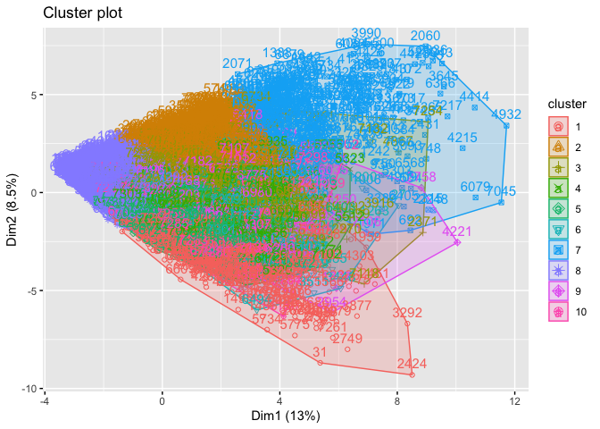

    ## [1] "Cluster Breakdown"

    ## 
    ##    1    2    3    4    5    6    7    8    9   10 
    ## 0.06 0.09 0.08 0.10 0.12 0.05 0.04 0.39 0.03 0.04

    ## # A tibble: 10 x 2
    ##    cluster2 count
    ##       <int> <int>
    ##  1        1   448
    ##  2        2   648
    ##  3        3   548
    ##  4        4   705
    ##  5        5   867
    ##  6        6   392
    ##  7        7   311
    ##  8        8  2878
    ##  9        9   186
    ## 10       10   321

The biggest cluster is cluster \#8, which account for around 40% out of
10 clusters.

### Clusters Profiling

The characteristic summary of NutrientH20’s Twitter followers in the
same cluster are as follows (without chatter):

Cluster 1: Highest cooking, photo\_sharing, fashion, beauty Cluster 2:
Highest sports\_fandom, religion,food, parenting Cluster 3: Highest
politics, travel, news Cluster 4: Highest health\_nutrition,
personal\_nutrition, cooking Cluster 5: Highest photo\_sharing, shopping
Cluster 6: Highest tv\_film, art Cluster 7: Highest sports\_fandom,
religion, food, parenting Cluster 8: Highest health\_nutrition,
photo\_sharing, current\_events, travel Cluster 9: Highest dating,
photo\_sharing, school Cluster 10: Highest college\_uni, online\_gaming

    ##                        1      2      3       4      5      6      7      8
    ## chatter           4.0714 3.4167 4.0967  3.7333 9.8847 3.9515 4.2412 3.1251
    ## current_events    1.7433 1.4614 1.5967  1.4809 2.0242 1.9490 1.8264 1.2571
    ## travel            1.4442 0.9306 6.0547  1.2199 1.0923 2.1964 1.5659 1.0274
    ## photo_sharing     5.8996 1.8256 2.2774  2.3362 6.0900 2.4337 3.0707 1.5757
    ## uncategorized     1.2366 0.6759 0.6788  0.9149 0.7993 1.4668 0.7492 0.6286
    ## tv_film           0.8460 0.7099 0.9945  0.8071 0.8420 5.6020 1.1125 0.7224
    ## sports_fandom     1.0781 3.8611 2.0493  1.1574 1.1338 1.2959 7.6592 0.7568
    ## politics          1.3862 1.0062 9.5036  1.2610 1.4556 1.6352 1.4051 0.9736
    ## food              0.9665 2.9691 1.4325  2.1617 0.7774 1.6173 5.8810 0.5924
    ## family            0.8393 1.7068 0.9033  0.7362 0.8281 0.7066 3.0675 0.4527
    ## home_and_garden   0.5871 0.5093 0.5602  0.5915 0.5502 0.7551 0.7717 0.3676
    ## music             1.2567 0.5355 0.6095  0.6667 0.8512 1.7066 0.9132 0.4451
    ## news              1.0513 0.8565 5.4635  1.1957 0.7451 1.3112 1.3087 0.6894
    ## online_gaming     1.1719 0.6682 0.8321  0.8837 0.7451 0.7066 1.4502 0.5844
    ## shopping          1.7388 0.9398 1.1807  1.2638 4.2330 1.4031 1.6302 0.6953
    ## health_nutrition  2.1920 1.2284 1.5383 12.6582 1.5998 1.8724 2.6141 1.1689
    ## college_uni       1.5424 0.7978 1.2682  0.9007 1.2491 2.5918 1.5949 0.8287
    ## sports_playing    0.8147 0.4846 0.6077  0.5872 0.5721 0.7577 0.9035 0.3902
    ## cooking          11.5179 0.9676 1.2500  3.4511 1.2203 1.4796 2.4920 0.8846
    ## eco               0.4955 0.4336 0.5639  0.9376 0.7463 0.5689 0.8199 0.2728
    ## computers         0.6987 0.4799 2.7026  0.5433 0.5917 0.4872 0.8746 0.3204
    ## business          0.5647 0.3519 0.6460  0.4454 0.6471 0.6709 0.6077 0.2397
    ## outdoors          0.7835 0.5216 0.8814  2.8851 0.4787 0.6939 0.8071 0.3860
    ## crafts            0.5558 0.6590 0.5602  0.5617 0.5294 1.1199 1.3344 0.2467
    ## automotive        0.8281 0.8580 2.2737  0.6199 1.0854 0.5383 1.3055 0.4868
    ## art               0.7210 0.4923 0.4197  0.5943 0.3795 4.8903 0.8232 0.3176
    ## religion          0.7679 3.2886 1.0255  0.7319 0.4983 1.1199 6.7428 0.3471
    ## beauty            4.1696 0.6682 0.4288  0.4213 0.3818 0.6888 1.5080 0.3138
    ## parenting         0.7366 2.4043 0.9635  0.7333 0.5352 0.6071 5.3859 0.3134
    ## dating            0.6094 0.3781 0.8741  0.7816 0.4383 0.4719 0.7395 0.3204
    ## school            0.8973 1.6235 0.6642  0.4922 0.6840 0.6658 3.4727 0.2915
    ## personal_fitness  1.3125 0.7145 0.9982  6.7106 1.0784 1.0842 1.6785 0.6550
    ## fashion           5.8772 0.6327 0.6022  0.7418 0.7209 0.8929 1.3730 0.4309
    ## small_business    0.4397 0.2701 0.4270  0.2397 0.4083 0.7959 0.4469 0.1970
    ## cluster1          5.0000 1.6960 2.9909  3.9957 1.5790 2.0842 2.0450 1.0330
    ##                       9      10
    ## chatter          7.9624  3.9688
    ## current_events   1.5914  1.4081
    ## travel           1.6452  1.5607
    ## photo_sharing    2.6989  2.6573
    ## uncategorized    1.5538  0.7788
    ## tv_film          0.9462  1.2960
    ## sports_fandom    1.2581  1.2243
    ## politics         1.5484  1.2991
    ## food             1.0914  1.1869
    ## family           0.7366  1.0436
    ## home_and_garden  0.9570  0.5826
    ## music            0.6505  0.6262
    ## news             1.0108  0.8318
    ## online_gaming    0.9839 10.8941
    ## shopping         1.1989  1.1433
    ## health_nutrition 2.2688  1.7695
    ## college_uni      1.4301 11.3458
    ## sports_playing   0.9301  2.8224
    ## cooking          1.4677  1.5701
    ## eco              0.6237  0.4735
    ## computers        0.7151  0.5607
    ## business         0.7204  0.3551
    ## outdoors         0.8602  0.5857
    ## crafts           0.8226  0.5327
    ## automotive       0.5806  0.8910
    ## art              0.7097  1.1651
    ## religion         1.0914  0.6916
    ## beauty           1.0161  0.3925
    ## parenting        1.0215  0.6760
    ## dating           9.2527  0.6511
    ## school           2.3172  0.4517
    ## personal_fitness 1.3495  1.0312
    ## fashion          2.5323  0.8660
    ## small_business   0.5860  0.3925
    ## cluster1         2.1720  6.0000

Here we repeat the same process as we did for 6 clusters using
non-scaled data and we can see that each cluster became more specific
and smaller. This made it more difficult to identify what segment of the
market the clusters could be refering to thus we pick 6 clusters as our
optimal cluster.

### Market Segmentation Analysis

Based on the 6 clusters(scaled), we found that cluster one correspond to
a more generalized segment of twitter followers with attributes that you
would expect from someone who follows the company and you don’t see any
outstanding attributes, all of their numbers are close to the mean with
nothing above 0.5. From cluster 2, we can see that parenting and
religion is the top 2 attributes (above 2) listed along with other
attributes that are also significant (above 1), this corresponds to the
segment of twitter followers who are mid-aged, have kids, and have a
more traditional life style. Cluster 3’s top attributes are political,
news, travel, automotives, and computers, where political and news takes
the lead among these attributes. This segment of followers are likely
those who are interested in political topics and what is going on in the
world, also might be more interested in the cars and the IT realm. All
of these attributes align with upper middle class males who has a more
luxurious life style and invest in their hobbies. In cluster 4, we
identify attributes such as health\_nutrition, personal\_fitness,
outdoors which appears in cluster 1 but have a higher frequency than
cluster 1. Eco was also a significant attribute in this cluster. From
these attributes, we can see that this segment of followers are those
who are more active in their daily life, more aware of the environment,
and lead a healthy lifestyle. From cluster 5, some significant
attributes are photo\_sharing, cooking(higher than cluster 1), beauty,
and fashion, which correlates to the segment of followers that are more
active on social media, sharing food contents to audience on a daily
basis. This could be a crowd of online influencers such as food bloggers
that already have an established audience, which the company could reach
out to for endorsement/promotions to gain consumers. Finally, cluster 6
have some interesting attributes such as college\_uni, sports\_playing,
and online\_gaming which are significant (above 2) comparing to the mean
threshold we used (0.3) along with some attibutes like art and tv\_film
that is only a little above the threshold. This cluster correspond to
college students who are interested in sports and gaming, which leans
more in the male college student side but can still be inclusive of
female college students as well. Furthermore, our clusters also share
similar attributes as the loadings result in our PCA, which show that
these segments are most likely true.

## Author Attribution

Revisit the Reuters C50 corpus that we explored in class. Your task is
to build the best model you can, using any combination of tools you see
fit, for predicting the author of an article on the basis of that
article’s textual content. Describe clearly what models you are using,
how you constructed features, and so forth. Yes, this is a supervised
learning task, but it potentially draws on a lot of what you know about
unsupervised learning, since constructing features for a document might
involve dimensionality reduction.

In the C50train directory, you have 50 articles from each of 50
different authors (one author per directory). Use this training data
(and this data alone) to build the model. Then apply your model to
predict the authorship of the articles in the C50test directory, which
is about the same size as the training set. Describe your data
pre-processing and analysis pipeline in detail.

In this section, we are processing the training data to eliminate stop
words, removing punctuation, make terms lowercase and more. The end
result is a document term matrix with tf-idf weights with 801 terms.

    ## <<DocumentTermMatrix (documents: 2500, terms: 801)>>
    ## Non-/sparse entries: 240686/1761814
    ## Sparsity           : 88%
    ## Maximal term length: 18
    ## Weighting          : term frequency - inverse document frequency (normalized) (tf-idf)

In this section, we do the same processing step we did for the training
set to the testing set.

Here we are getting rid of all the words that are in the testing set but
not in the training set to make the two matrix the same length.

    ## <<DocumentTermMatrix (documents: 2500, terms: 801)>>
    ## Non-/sparse entries: 241658/1760842
    ## Sparsity           : 88%
    ## Maximal term length: 18
    ## Weighting          : term frequency - inverse document frequency (normalized) (tf-idf)

### Principal Component Analysis

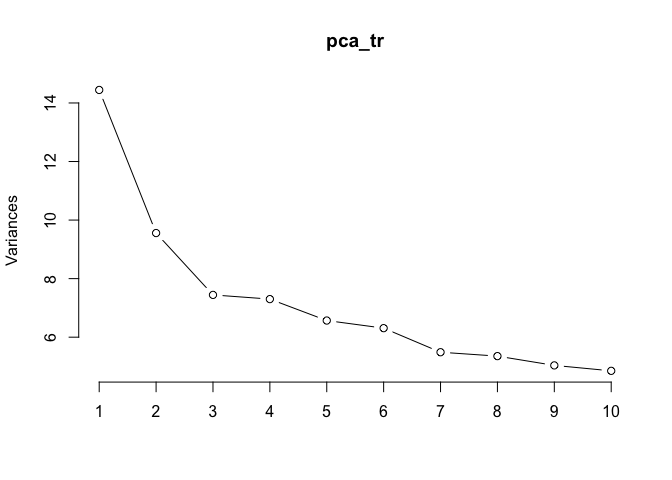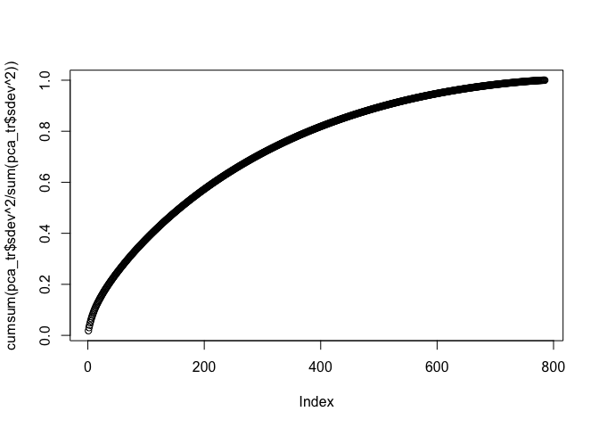

    ##     Standard deviation Proportion of Variance  Cumulative Proportion 
    ##                1.21607                0.00188                0.50074

In this section, we are trying to reduce the dimensions using PCA. We
found that at PC159, around 50% of the variance is explained, therefore
we use that as a cutoff for the number of features(PC) we pass in to our
model.

### Naive-Bayes

    ## Accuracy 
    ##   0.0192

### Random Forest

    ## Accuracy 
    ##   0.7456

In this section, we tried different kinds of model for classifying the
documents. The random forest model had the highest accuracy which is
around 75%

## Association Rule Mining

Use the data on grocery purchases and find some interesting association
rules for these shopping baskets. Pick your own thresholds for lift and
confidence; just be clear what these thresholds are and how you picked
them. Do your discovered item sets make sense? Present your discoveries
in an interesting and concise way.

### Exploratory Analysis

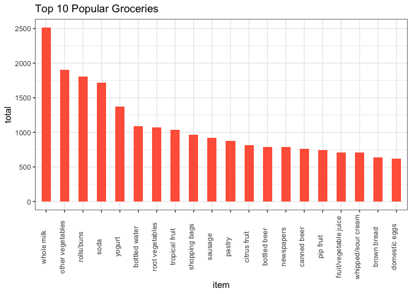

Whole Milk was by far the most popular grocery with a count near 2500.

    ## To reduce overplotting, jitter is added! Use jitter = 0 to prevent jitter.

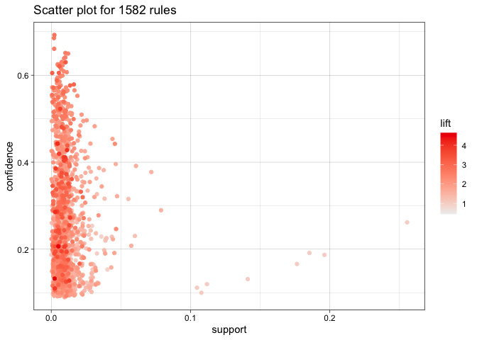

    ## To reduce overplotting, jitter is added! Use jitter = 0 to prevent jitter.

From this scatter plot, we can see that the large majority of rules have
support values less than 0.025 but a varying confidence. There also is a
slight correlation that the larger lifts have lower confidences. We can
see that the size of the rules are clustred in a way that lower support
valued rules have larger rule sizes.

### Networks

We only have 6 rules due to the using a support of .05 and confidence
threshold of .1.

    ##     lhs                   rhs                support confidence coverage lift 
    ## [1] {yogurt}           => {whole milk}       0.05602 0.4016     0.1395   1.572
    ## [2] {whole milk}       => {yogurt}           0.05602 0.2193     0.2555   1.572
    ## [3] {rolls/buns}       => {whole milk}       0.05663 0.3079     0.1839   1.205
    ## [4] {whole milk}       => {rolls/buns}       0.05663 0.2216     0.2555   1.205
    ## [5] {other vegetables} => {whole milk}       0.07483 0.3868     0.1935   1.514
    ## [6] {whole milk}       => {other vegetables} 0.07483 0.2929     0.2555   1.514
    ##     count
    ## [1] 551  
    ## [2] 551  
    ## [3] 557  
    ## [4] 557  
    ## [5] 736  
    ## [6] 736

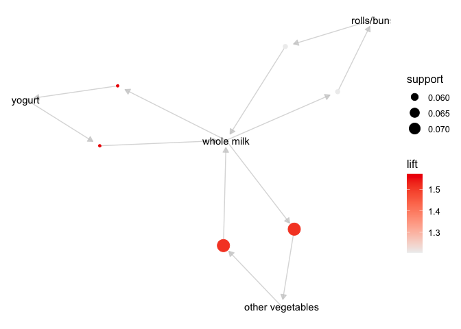

Now, we have 38 rules when using a support of .03 and confidence
threshold of .05. Due to the size of the rules, we are only including
the first 10 rules in our output.

    ##      lhs                     rhs                  support confidence coverage
    ## [1]  {whipped/sour cream} => {whole milk}         0.03223 0.4496     0.07168 
    ## [2]  {whole milk}         => {whipped/sour cream} 0.03223 0.1261     0.25552 
    ## [3]  {pip fruit}          => {whole milk}         0.03010 0.3978     0.07565 
    ## [4]  {whole milk}         => {pip fruit}          0.03010 0.1178     0.25552 
    ## [5]  {pastry}             => {whole milk}         0.03325 0.3737     0.08897 
    ## [6]  {whole milk}         => {pastry}             0.03325 0.1301     0.25552 
    ## [7]  {citrus fruit}       => {whole milk}         0.03050 0.3686     0.08277 
    ## [8]  {whole milk}         => {citrus fruit}       0.03050 0.1194     0.25552 
    ## [9]  {sausage}            => {rolls/buns}         0.03060 0.3258     0.09395 
    ## [10] {rolls/buns}         => {sausage}            0.03060 0.1664     0.18393 
    ##      lift  count
    ## [1]  1.760 317  
    ## [2]  1.760 317  
    ## [3]  1.557 296  
    ## [4]  1.557 296  
    ## [5]  1.463 327  
    ## [6]  1.463 327  
    ## [7]  1.442 300  
    ## [8]  1.442 300  
    ## [9]  1.771 301  
    ## [10] 1.771 301

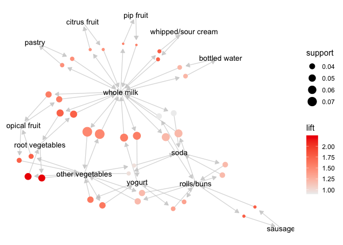

Finally, we have 522 rules when we relaxed our thresholds to support
being equal to .01 and our confidence threshold being equal to .01. Due
to the size of the rules, we are only including the first 10 rules in
our output.

    ##      lhs                   rhs                support confidence coverage lift 
    ## [1]  {hard cheese}      => {whole milk}       0.01007 0.41079    0.02450  1.608
    ## [2]  {whole milk}       => {hard cheese}      0.01007 0.03940    0.25552  1.608
    ## [3]  {butter milk}      => {other vegetables} 0.01037 0.37091    0.02796  1.917
    ## [4]  {other vegetables} => {butter milk}      0.01037 0.05360    0.19349  1.917
    ## [5]  {butter milk}      => {whole milk}       0.01159 0.41455    0.02796  1.622
    ## [6]  {whole milk}       => {butter milk}      0.01159 0.04536    0.25552  1.622
    ## [7]  {ham}              => {whole milk}       0.01149 0.44141    0.02603  1.728
    ## [8]  {whole milk}       => {ham}              0.01149 0.04497    0.25552  1.728
    ## [9]  {sliced cheese}    => {whole milk}       0.01078 0.43983    0.02450  1.721
    ## [10] {whole milk}       => {sliced cheese}    0.01078 0.04218    0.25552  1.721
    ##      count
    ## [1]   99  
    ## [2]   99  
    ## [3]  102  
    ## [4]  102  
    ## [5]  114  
    ## [6]  114  
    ## [7]  113  
    ## [8]  113  
    ## [9]  106  
    ## [10] 106

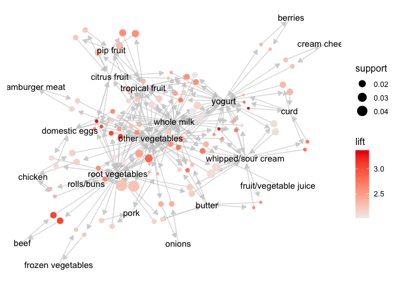

### Association Rule Mining Analysis

From these, we can see that whole milk is the most important item, and
that makes sense as it is a staple in most diets. Next would be yogurt
and other vegetables, which also makes sense as they are staple items.
Some other things that we see, are that meat is correlated with
vegetables, so putting some coupons or deals for meat in the veggie
section could help increase meat sales. Perhaps, we can put some berries
next in the yogurt aisle to encourage people to buy berries and make a
nice parfait. Between dairy items such as milk(whole and butter) and
cheese(hard and slices), there seems to be a high lift value. These
dairy items are compliments of each other so putting them in close
proximity of each other will increase sales of these items.
